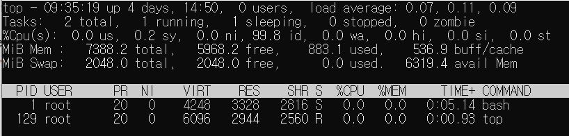
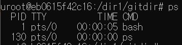
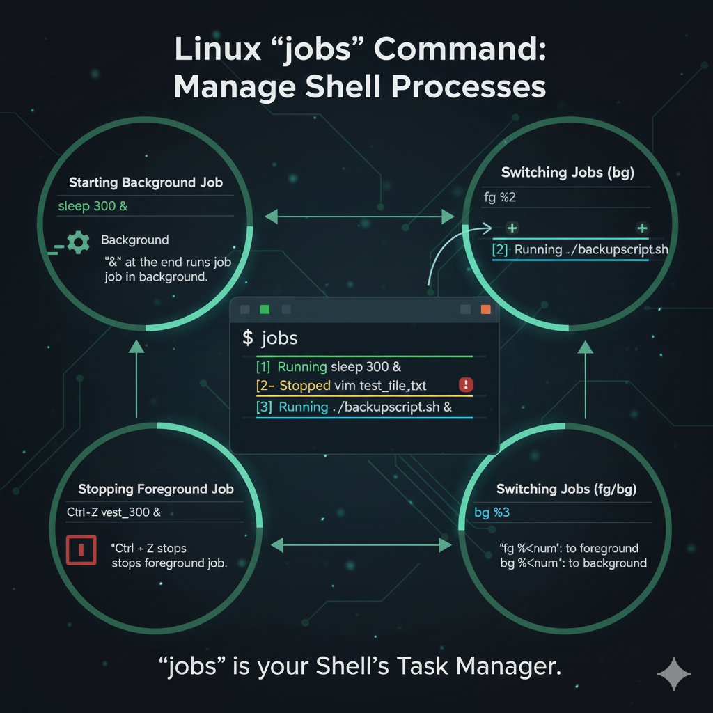

# top, ps, jobs, kill 
[](https://git.io/typing-svg)


---

## 📌 top : 실시간 시스템 모니터링

`top` 이란...

리눅스에서 **시스템의 실시간 프로세스 정보**를 확인할 수 있는 도구.

CPU, 메모리 사용량, 프로세스 정보 등을 **실시간으로 모니터링**할 수 있어 시스템 관리자에게 유용하다.




| 항목        | 설명                                   | 비고                                      |
|-------------|----------------------------------------|-------------------------------------------|
| Load Average | 1분, 5분, 15분간의 평균 부하             | CPU 코어 수보다 높으면 과부하 상태          |
| Tasks       | 전체, 실행중(running), 대기(sleeping), 정지(stopped) | zombie 프로세스 존재 여부 확인 필수 |
| %Cpu(s)     | us(사용자), sy(커널), id(유휴), wa(IO대기) | wa가 높으면 디스크 I/O 병목 의심       |


### 🖥️ TOP 실행 중 입력 가능한 주요 명령어

**top** 명령어 실행 상태에서 사용 가능한 단축키들
정렬, 필터링, 프로세스 제어 등에 빠르게 접근할 수 있어 시스템 모니터링에 유용하다.

---


### 정렬 변경

| 단축키 | 기능 설명 |
|--------|-----------|
| **P** | CPU 사용량 순 정렬 *(기본값)* |
| **M** | 메모리 사용량 순 정렬 |
| **T** | 실행 시간(Time) 순 정렬 |


### 필터링 & 제어

| 단축키 | 기능 설명 |
|--------|-----------|
| **u** | 특정 사용자의 프로세스만 표시 *(User 입력 필요)* |
| **k** | 프로세스 종료 *(PID 입력 → Signal 입력)* |
| **c** | 프로세스의 전체 경로(Command Path) 표시/숨기기 |
| **1** | 멀티코어 CPU 사용량을 코어별로 개별 표시 |

---

## 📌 `PS` : 실행 중인 프로세스 정보를 출력

`PS`란...

프로세스 번호, 실행 사용자, CPU·메모리 사용량, 실행 시간 등의 정보를 확인할 수 있다.

시스템 관리나 디버깅 과정에서 자주 사용된다.



| 항목      | 의미                  |
| ------- | ------------------- |
| PID     | 프로세스 ID             |
| PPID    | 부모 프로세스 ID          |
| USER    | 프로세스를 실행한 사용자       |
| %CPU    | 프로세스의 CPU 사용률       |
| %MEM    | 프로세스의 메모리 사용률       |
| STAT    | 프로세스 상태(R, S, Z 등)  |
| TIME    | 프로세스가 사용한 CPU 시간    |
| COMMAND | 실행 중인 명령 또는 프로그램 이름 |


---


### 🖥️ PS 실행 중 입력 가능한 주요 명령어

| 옵션                       | 설명                                        |
| ------------------------ | ----------------------------------------- |
| **ps -e**                | 시스템에서 실행 중인 모든 프로세스를 출력               |
| **ps -f**                | 프로세스를 상세한 풀 포맷으로 출력                   |
| **ps -ef**               | 모든 프로세스를 전체 정보와 함께 출력        |
| **ps aux**               | CPU, 메모리 등 다양한 정보 출력 |
| **ps aux --sort=-%cpu**  | CPU 사용량 기준으로 정렬해 출력             |
| **ps -u <user>**         | 특정 사용자가 실행한 프로세스만 표시                 |


### ps 명령어 사용 예시와 활용

+ 시스템에서 특정 프로그램이 **제대로 실행되고 있는지 확인**할 때

+ 서버에서 비정상적으로 **CPU나 메모리를 많이 쓰는 프로세스**를 찾을 때

+ 배경에서 남아있는 **좀비 프로세스 확인**할 때

+ kill 명령어로 종료하기 위해 **PID**를 찾을 때

예를 들어, CPU를 많이 사용하는 프로세스를 찾고 싶다면:

`ps aux --sort=-%cpu | head` 이렇게 하면 **CPU 사용량이 높은 순서대로 확인**할 수 있다.

### ps와 top의 차이점 요약


프로세스 정보를 확인하는 데 사용되는 두 핵심 명령어인 `top`과 `ps`의 차이점은 정보를 표시하는 방식(동적 vs 정적)에 있다.


| 구분 | top | ps |
| :--- | :--- | :--- |
| 정보 표시 방식 | **실시간** 업데이트 (동적) | **특정 시점**의 스냅샷 (정적) |
| 실행 모드 | **대화형(Interactive)**, 지속 실행 | **단발성**, 실행 후 즉시 종료 |
| 주요 용도 | 시스템 **부하 및 성능 모니터링**, 실시간 진단 | 특정 프로세스 **상태/PID 확인**, 스크립트 활용 |
| CPU/메모리 | 시스템 전체 요약 및 프로세스별 **변화 추이** 표시 | 프로세스별 **명령 실행 당시** 상태 표시 |
| 예를 들면.. | 켜놓고 보는 **CCTV** 혹은 **대시보드** | 한 번 찍는 **사진** 혹은 **스냅샷** |

---

## 📌 jobs : 셸 목록 상태 관리 확인

`jobs`는... 

현재 사용 중인 셸 세션에서 실행되었거나 일시 정지된 **작업(Job)의 상태를 표시**한다. 

여기서 작업(Job)이란, 사용자가 **커맨드 라인에 입력한 명령어 하나 또는 파이프(|)로 연결된 명령어들의 그룹**을 의미하며, 

이는 셸이 관리하는 처리 단위이다.

### 주요 기능


+ 작업 목록 확인: 현재 셸에서 **백그라운드로 실행 중**이거나, Ctrl + Z 키로 **일시 정지**된 작업들의 목록을 보여준다.

+ 작업 상태 표시: 각 작업의 고유 번호, 상태, 그리고 실행 명령어를 표시한다.

+ 작업 관리 준비: fg (포그라운드 전환), bg (백그라운드 실행), kill (종료) 등의 다른 작업 제어 명령어와 연동해 작업을 지정하고 관리할 수 있도록 **작업 번호**를 제공한다.




### 사용법 및 출력 형식

**기본 사용법 :**
`$ jobs <옵션>`


**출력 형식**
```
user@linux:~$ ping google.com &
[1] 12345
user@linux:~$ jobs
[1]+  Running                 ping google.com &
```
위 예제에서는 ping 명령어가 백그라운드에서 실행되며, 작업 번호는 1번, 프로세스 ID는 12345이다.

jobs 명령어를 입력하면, **현재 실행 중인 작업 목록**이 표시된다.


이제 다른 명령어를 실행하고, 중간에 일시 중지한 후 작업 목록을 다시 확인해보자.


```
user@linux:~$ sleep 100
^Z
[2]+  Stopped                 sleep 100
user@linux:~$ jobs
[1]-  Running                 ping google.com &
[2]+  Stopped                 sleep 100
```


Ctrl + Z로 sleep 명령어를 일시 중지했다. 

이때 jobs 명령어를 사용하면 두 개의 작업이 표시된다. 

첫 번째 작업은 ping 명령어로 *Running(실행 중)* 상태이며, 두 번째 작업은 sleep 명령어로 *Stopped(중지)* 상태이다.

### 출력 형식의 구성 요소


| 항목 | 출력 예시 | 의미 |
| :--- | :--- | :--- |
| **작업 번호** | `[1]` | 셸이 할당한 작업의 고유 번호이다. `fg`, `bg`, `kill` 명령에서 **`%[작업 번호]`** 형태로 작업을 지정할 때 사용한다. |
| **작업 순서** | `+` 또는 `-` | 작업의 최근 접근 순서를 표시한다.<br>• **`+`**: 가장 최근에 접근한 작업 (기본 전환 대상)이다.<br>• **`-`**: `+` 작업 바로 전에 접근한 작업이다. |
| **상태** | `Running` | 작업의 현재 상태를 표시한다. 주요 상태는 다음과 같다.<br>• **Running**: 백그라운드에서 실행 중이다.<br>• **Stopped**: `Ctrl` + `Z` 등으로 일시 정지된 상태이다.<br>• **Done**: 작업이 완료된 상태이다. |
| **명령어** | `sleep 50 &` | 해당 작업을 시작한 명령어와 옵션이다. |


### jobs 를 활용한 작업 제어 흐름

* **작업 일시 정지:** 포그라운드(화면에서 실행 중인) 작업 도중 `Ctrl` + `Z`를 누르면 작업이 **Stopped** 상태로 전환되며, `jobs` 목록에 추가된다.

  
* **백그라운드 실행:** `jobs`로 확인된 **Stopped** 상태의 작업(예: `[2]`)을 `bg %2` 명령을 사용하여 백그라운드에서 다시 **Running** 상태로 실행될 수 있다.

  
* **포그라운드 전환:** 백그라운드에서 실행 중인 작업(예: `[1]`)을 `fg %1` 명령을 사용하여 다시 포그라운드로 전환하여 터미널에서 작업 결과를 직접 확인할 수 있다.


---


## 📌 kill : 프로세스에게 시그널 전송


`kill`이란...


이름과는 달리 **단순히 프로세스를 종료**하는 것 외에도, 특정 프로세스에게 **시그널**을 보내어 다양한 제어를 수행하는 데 사용되는 명령어이다.

### kill 명령어 사용법

`kill [옵션/시그널 번호 또는 이름] [PID 또는 %Job ID]`

+ PID (Process ID): ps나 top 명령어로 확인할 수 있는 **프로세스의 고유 식별 번호**

+ Job ID: jobs 명령어로 확인할 수 있는 현재 셸에서 관리되는 **백그라운드 작업 번호**입니다. %1, %2 와 같이 사용한다.

> kill 명령어의 핵심은 PID (Process ID) 또는 Job ID로 식별되는 **특정 프로세스에게 미리 정의된 시그널을 전송**하는 것이다.
> 프로세스는 이 시그널을 받으면, **시그널의 종류**에 따라 미리 정의된 동작(ex: 종료, 재시작, 설정 파일 다시 읽기)을 수행하게 된다.

### 참고
[리눅스 ps 명령어 참고자료](https://zzsza.github.io/development/2018/07/18/linux-top/)


[리눅스 jobs 명령어 참고자료](https://monkeybusiness.tistory.com/630#google_vignette)


[리눅스 kill 명령어 참고자료](https://monkeybusiness.tistory.com/626/630#google_vignette)

